# UNIVERSIDAD TÉCNICA PARTICULAR DE LOJA


## FACULTAD DE INGENIERÍAS Y ARQUITECTURA  
### MAESTRÍA EN INTELIGENCIA ARTIFICIAL APLICADA

---

## Trabajo académico final escrito: Generar una aplicación de inteligencia artificial que use librerías de software libre a través de herramientas colaborativas

**Autor:** Freddy Hernán Villota González  
**Docente:** M.Sc. Alexandra Cristina González Eras  
**Fecha:** 30 de mayo de 2025  

---

# OBJETIVO DEL PROYECTO

Desarrollar una aplicación interactiva en Streamlit que permita calcular, visualizar y analizar el balance hídrico mensual y anual en la provincia de Carchi (Ecuador), integrando datos históricos observados (ERA5) y proyecciones climáticas futuras (CMIP6), con el fin de facilitar la toma de decisiones informadas en la gestión hídrica mediante el uso de modelos de aprendizaje automático y datos remotos.


# INTRODUCCIÓN
El balance hídrico es una herramienta fundamental en la gestión sostenible de los recursos hídricos, ya que permite cuantificar las entradas y salidas de agua en un sistema determinado, como una cuenca hidrográfica, en un periodo específico. Este análisis es crucial para entender la disponibilidad de agua, planificar su uso eficiente y anticipar posibles escenarios de escasez o exceso hídrico (Doods y Whiles, 2010).

La integración de tecnologías modernas ha revolucionado la forma en que se realiza el análisis del balance hídrico. Por ejemplo, la plataforma Google Earth Engine (GEE) proporciona acceso a una vasta colección de datos geoespaciales y capacidades de procesamiento en la nube, facilitando el análisis de grandes volúmenes de información climática y ambiental (Wu, 2021). Asimismo, Streamlit es una herramienta de código abierto que permite la creación rápida de aplicaciones web interactivas en Python, lo que facilita la visualización y el análisis de datos en tiempo real (Streamlit, s.f.).

En este contexto, el presente proyecto tiene como objetivo desarrollar una aplicación web interactiva que permita calcular y visualizar el balance hídrico histórico y proyectado para la provincia de Carchi, Ecuador. Para ello, se integran datos de reanálisis climático de ERA5, que ofrece estimaciones horarias de variables atmosféricas desde 1940 hasta la actualidad (Hersbach *et al*., 2023), y proyecciones futuras basadas en los modelos climáticos del Coupled Model Intercomparison Project Phase 6 (CMIP6), que proporcionan simulaciones del sistema climático bajo diferentes escenarios de emisiones (Eyring et al., 2016).

La aplicación desarrollada busca ser una herramienta útil para investigadores, gestores de recursos hídricos y tomadores de decisiones, al proporcionar información detallada y visualizaciones interactivas sobre la dinámica hídrica en la región de estudio. Además, se espera que esta herramienta contribuya a una mejor comprensión de los posibles impactos del cambio climático en la disponibilidad de recursos hídricos y apoye en la planificación de estrategias de adaptación y mitigación.

# MARCO TEÓRICO DE LAS TECNOLOGÍAS Y LIBRERÍAS UTILIZADAS

Este proyecto integra diversas herramientas y bibliotecas de código abierto que permiten la construcción de una aplicación web interactiva para el análisis del balance hídrico. A continuación, se describen las principales tecnologías empleadas:

## Streamlit
Streamlit es un framework de código abierto en Python que facilita la creación de aplicaciones web interactivas para ciencia de datos y aprendizaje automático. Permite a los desarrolladores convertir scripts de Python en aplicaciones web compartibles con pocas líneas de código, sin necesidad de conocimientos en desarrollo web. Su simplicidad y rapidez lo hacen ideal para prototipos y dashboards de datos (Streamlit, s.f.). 

## Google Earth Engine (GEE)
Google Earth Engine es una plataforma de procesamiento geoespacial en la nube que permite el análisis y visualización de grandes volúmenes de datos satelitales y geoespaciales. Ofrece acceso a un catálogo de datos públicos y herramientas para realizar análisis a escala planetaria, siendo ampliamente utilizada en estudios ambientales y de cambio climático (Google Developers, s.f.). 

## Geemap
Geemap es una biblioteca de Python que proporciona una interfaz interactiva para trabajar con Google Earth Engine. Facilita la visualización y análisis de datos geoespaciales mediante mapas interactivos, integrándose con herramientas como Jupyter Notebook y Streamlit. Además, permite la conversión de scripts de JavaScript a Python, agilizando el desarrollo de aplicaciones geoespaciales (Geemap, s.f.). 

## Bokeh
Bokeh es una biblioteca de visualización interactiva en Python que permite la creación de gráficos y dashboards para navegadores web modernos. Es especialmente útil para representar grandes volúmenes de datos y crear visualizaciones dinámicas sin necesidad de escribir código en JavaScript. 

## Pyngrok
Pyngrok es un envoltorio en Python para ngrok, una herramienta que permite exponer servidores locales a través de túneles seguros en la nube. Con Pyngrok, es posible crear túneles HTTP y HTTPS desde aplicaciones Python, facilitando el despliegue y prueba de aplicaciones web en entornos locales como Google Colab (Pyngrok, s.f.). 

## Pandas
Pandas es una biblioteca de código abierto ampliamente utilizada en ciencia de datos para la manipulación y análisis de estructuras de datos tabulares en Python. Proporciona estructuras de datos como DataFrame y Series, que permiten manejar, limpiar, transformar y resumir datos de forma eficiente (Holmgren *et al.*, 2015). Es especialmente útil para análisis exploratorio y procesamiento previo de datos antes de aplicar modelos de aprendizaje automático.

## Scikit-learn
Scikit-learn es una biblioteca de aprendizaje automático en Python que ofrece herramientas eficientes para el modelado predictivo y análisis de datos. Soporta una amplia variedad de algoritmos supervisados y no supervisados, como regresión, clasificación, clustering, selección de características, validación cruzada y escalado de datos (Pedregosa *et al*., 2011). En este proyecto, se utilizó MinMaxScaler para normalizar las variables antes de entrenar el modelo.

## MLflow
MLflow es una plataforma de código abierto para gestionar el ciclo de vida completo del aprendizaje automático, incluyendo la experimentación, el registro de modelos y su despliegue. Permite rastrear experimentos, comparar métricas, almacenar artefactos y versionar modelos, facilitando la reproducibilidad de los procesos de modelado (Zaharia *et al*., 2018). En este proyecto, MLflow se utilizó para registrar los experimentos de XGBoost y seleccionar el mejor modelo según las métricas de evaluación.

## Google Colab
Google Colab es un servicio gratuito que proporciona entornos Jupyter Notebook en la nube, lo que permite ejecutar código Python en GPU o TPU sin necesidad de instalar nada localmente. Es ideal para el desarrollo colaborativo, el uso intensivo de bibliotecas como TensorFlow, y el análisis de datos con pandas, geemap y Earth Engine (Bisong, 2019). Se empleó Colab como entorno principal para la integración de todo el flujo de trabajo.

## Supabase
Supabase es una alternativa de código abierto a Firebase, que proporciona una base de datos PostgreSQL, autenticación, almacenamiento y API RESTful automáticamente generadas. Se usó en este proyecto para almacenar los datos de proyecciones climáticas (CMIP6) en una tabla SQL y consultarlos dinámicamente desde Streamlit mediante la API REST (Supabase, s. f.).


# DESCRIPCIÓN DE LOS DATASETS USADOS

## ERA5-Land
El conjunto de datos ERA5-Land es una reconstrucción reanalizada de variables climáticas de superficie, desarrollada por el Centro Europeo de Predicción Meteorológica a Medio Plazo (ECMWF) como parte del programa Copernicus Climate Change Service (C3S). Proporciona información meteorológica global con una alta resolución espacial (~9 km) y una frecuencia temporal mensual, diaria y horaria, desde 1950 hasta el presente (Muñoz Sabater, 2019).

En este proyecto, se utilizó la colección mensual ECMWF/ERA5_LAND/MONTHLY disponible en Google Earth Engine (GEE), de la cual se extrajeron las siguientes variables relevantes para el cálculo del balance hídrico:

- Temperatura del aire a 2 m
- Temperatura del punto de rocío
- Radiación solar neta
- Radiación térmica neta
- Velocidad del viento (componentes u y v)
- Precipitación total

A partir de estas variables, se calculó la evapotranspiración potencial (PET) mediante la ecuación de Penman-Monteith (FAO-56), y luego el balance hídrico mensual como la diferencia entre la precipitación y la PET.

## Proyecciones climáticas CMIP6
Para el análisis de proyecciones futuras, se utilizaron datos derivados del proyecto Coupled Model Intercomparison Project Phase 6 (CMIP6), específicamente del modelo ACCESS-ESM1-5, correspondiente al escenario SSP2-4.5. Este escenario representa un camino intermedio de desarrollo sostenible con mitigación moderada del cambio climático (Program for Climate Model Diagnosis and Intercomparison, 2019).

Los datos fueron preprocesados y ajustados para representar la provincia de Carchi, Ecuador, y se almacenaron en una base de datos SQL en la plataforma Supabase. El conjunto de datos incluyó variables climáticas como:

- Precipitación diaria acumulada (transformada a mensual)
- Temperatura del aire
- Radiación solar
- Velocidad del viento (componentes u y v)

Estas variables se usaron como entradas para un modelo de aprendizaje automático (XGBoost) previamente entrenado para estimar el balance hídrico mensual proyectado entre los años 2015 y 2049.

# DESCRIPCIÓN DE LOS PASOS REALIZADOS EN EL PROYECTO

## Fase 1: Obtención de datos históricos desde ERA5 y cálculo del balance hídrico

### Objetivo

Esta fase tiene como objetivo obtener los datos climáticos históricos desde ERA5 mediante Google Earth Engine (GEE), calcular la Evapotranspiración Potencial (PET) usando la ecuación FAO-56 Penman-Monteith y generar una base de datos mensual de balance hídrico para la provincia de Carchi (Ecuador), la cual será utilizada en proyecciones futuras.

---

### Pasos principales

#### 1. Preparación del entorno

* Se monta Google Drive en Google Colab.
* Se instala y configura la librería `geemap` y se autentica la cuenta de Google Earth Engine.

```python
from google.colab import drive
drive.mount('/content/drive')
!pip install geemap --upgrade
import geemap
import ee
ee.Authenticate()
ee.Initialize(project="ee-freddyvillota")
```

#### 2. Exploración del área de estudio

* Se cargan las capas de provincias y cantones desde GAUL en Earth Engine.
* Se define el ROI de estudio para la provincia de Carchi.

```python
ec_provincias = ee.FeatureCollection("FAO/GAUL/2015/level1").filter(ee.Filter.eq("ADM0_NAME", "Ecuador"))
```

#### 3. 💧 Cálculo de la Evapotranspiración Potencial (PET) con la ecuación de Penman–Monteith (FAO-56) usando ERA5-Land

Este flujo de trabajo describe paso a paso cómo calcular la evapotranspiración potencial mensual utilizando la ecuación de Penman–Monteith (FAO-56) dentro de Google Earth Engine (GEE), a partir de variables climáticas extraídas del conjunto de datos ERA5-Land. Se define la función `calcPet(img)` que implementa la fórmula de Penman-Monteith con variables de ERA5:

* Temperatura del aire
* Temperatura del punto de rocío
* Radiación neta solar y térmica
* Velocidad del viento

La PET se calcula en mm/día.

```python
def calcPet(img):
    ...  # código completo 
    return pet.rename('PET')
```
Es importante considerar que cada variable debe ser procesada antes de aplicar la ecuación.

---

**Conversión de temperaturas a grados Celsius (°C)**

Se convierten las temperaturas desde Kelvin a grados Celsius:

```javascript
T = temperature_2m.subtract(273.15);      // Temperatura media del aire (°C)
Td = dewpoint_temperature_2m.subtract(273.15);  // Temperatura del punto de rocío (°C)
```

---

**Radiación neta media diaria (Rₓ)**

Se calcula la radiación neta mensual sumando la radiación solar y térmica neta, luego se convierte de J/m² a MJ/m² y se divide por el número de días del mes:

```javascript
Ra = surface_net_solar_radiation.add(surface_net_thermal_radiation).divide(1e6);  // MJ/m²/mes
days = date.advance(1, 'month').difference(date, 'day');
Rn = Ra.divide(days);  // MJ/m²/día
```

---

**Presión de vapor de saturación (eₛ)**

Se calcula la presión de vapor de saturación a partir de la temperatura media del aire:

```javascript
es = T.expression(
  '0.6108 * exp((17.27 * T) / (T + 237.3))', {
    'T': T
  }
);
```

---

**Presión de vapor real (eₐ)**

Se calcula a partir de la temperatura del punto de rocío:

```javascript
ea = Td.expression(
  '0.6108 * exp((17.27 * Td) / (Td + 237.3))', {
    'Td': Td
  }
);
```

---

**Pendiente de la curva de presión de vapor (∆)**

Se deriva a partir de la presión de vapor de saturación:

```javascript
delta = es.expression(
  '4098 * es / pow((T + 237.3), 2)', {
    'es': es,
    'T': T
  }
);
```

---

**Constante psicrométrica (γ)**

Se estima utilizando una presión atmosférica estándar de 101.3 kPa:

```javascript
gamma = ee.Number(1.013e-3).multiply(101.3).divide(0.622 * 2.45);
```

> *Opcionalmente*, se puede calcular la presión atmosférica con base en la altitud (`z`, en metros):

```javascript
P = ee.Number(101.3).multiply(
  ((293 - 0.0065 * z) / 293) ** 5.26
);
gamma = P.multiply(1.013e-3).divide(0.622 * 2.45);
```

---

**Velocidad del viento a 2 metros (u₂)**

Se calcula la magnitud del viento a 10 m y luego se ajusta a 2 m según la metodología FAO:

```javascript
u = u10.pow(2).add(v10.pow(2)).sqrt();  // Magnitud del viento a 10 m
u2 = u.multiply(4.87).divide(Math.log(67.8 * 10 - 5.42));  // Conversión a 2 m
```

---

**Cálculo de la PET con la fórmula FAO-56**

Se implementa la ecuación principal:

```javascript
PET = delta.multiply(0.408).multiply(Rn)
      .add(gamma.multiply(900).divide(T.add(273)).multiply(u2).multiply(es.subtract(ea)))
      .divide(delta.add(gamma.multiply(1 + 0.34 * u2)));
```

> Nota: El término de calor del suelo (G) se asume **0** para promedios mensuales, conforme a FAO-56.

El resultado es la PET expresada en **mm/día**.

---

**Conversión a PET mensual (opcional)**

Si se desea obtener la evapotranspiración mensual, se multiplica por el número de días del mes:

```javascript
PET_monthly = PET.multiply(days);
```

---

**Consideraciones finales**

* Esta implementación permite monitorear la demanda atmosférica de agua en diferentes regiones.
* Es útil para estudios agroclimáticos, de balance hídrico y para evaluar el estrés hídrico potencial.
* Es importante validar que las variables de entrada (temperaturas, viento, radiación) correspondan a unidades y formatos esperados.


#### 4. Visualización en GEE

Se carga un mes específico (ej. diciembre 2020), se calcula la PET para ese mes y se visualiza el resultado en un mapa con `geemap`, junto a la precipitación y el contorno de la provincia.

```python
Map = geemap.Map(center=[0.95, -78.4], zoom=8)
Map.addLayer(pet_registro1, vis, 'PET - diciembre')
Map.add_colorbar(vis_params=vis, label='PET (mm/día)')
Map.addLayer(roi.style(color='red', width=2), {}, "Carchi")
Map
```
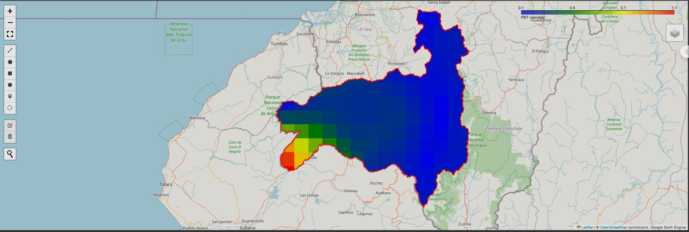

#### 5. Extracción de series temporales desde GEE

Se extraen los valores promedio mensuales de PET desde 1981 a 2024 para la provincia de Carchi.

```python
# Aplicar calcPet a la colección ERA5
era5_pet = era5.map(calcPet)
```

Se convierte en lista de `ee.Feature` y luego a `pandas.DataFrame` con columnas `date`, `year`, `month`, `PET_mm_day` y `PET_mm_month`.

#### 6. Extracción de otras variables climáticas

* Precipitación total (mm)
* Temperatura (C)
* Radiación solar (MJ/m²)
* Componentes de viento (u, v)

Estas variables se combinan con la PET para calcular el balance hídrico mensual.

```python
df_balance_H['balance_mm'] = df_balance_H['precip_mm'] - df_balance_H['PET_mm_month']
```

#### 7. Exportación de datos

Los datos se exportan como CSV a Drive para ser usados en etapas posteriores del proyecto.

```python
export_path = '/content/drive/.../df_balanceH_historico.csv'
df_balance_H.to_csv(export_path, index=False)
```

#### 8. Visualización de resultados

Se grafican:

* Serie mensual de balance hídrico
* Tendencia del balance hídrico medio anual
* Anomalías del balance hídrico respecto a la media

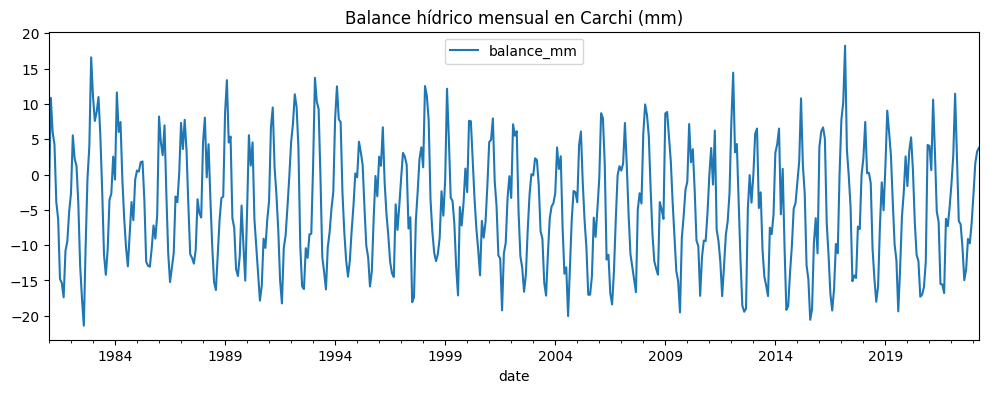

Interpretación:

* 🔵 Años con balance hídrico superior al promedio (mayor disponibilidad hídrica)
* 🔴 Años con balance inferior al promedio (estrés hídrico)

---

### Función general para GEE

Se desarrolló la función `mostrar_balance_hidrico_con_capas` que permite visualizar:

* Precipitación
* PET
* Balance hídrico

...para cualquier provincia y mes dentro del rango ERA5 (1981 a la fecha).

```python
Map = mostrar_balance_hidrico_con_capas(2022, 7, pais="Mexico", provincia="Jalisco")
Map
```
## Fase 2 – Proyecciones futuras CMIP6 (2015–2049) y conexión a Supabase

Esta fase describe el proceso completo para generar un dataset con proyecciones climáticas futuras (2015–2049) a partir de datos CMIP6 descargados del Climate Data Store (CDS), transformarlos a un formato tabular (`DataFrame`) y almacenarlos en Supabase para su uso posterior en aplicaciones web.

---

### ✨ Objetivo

* Obtener datos mensuales proyectados para la provincia de **Carchi** (Ecuador) desde CMIP6 (SSP2-4.5).
* Procesar archivos `.nc` y transformar variables climáticas a unidades adecuadas.
* Almacenar los datos en una base SQL en Supabase para integración en la app.

---

### ᵚ Paso 1. Descargar datos CMIP6 desde CDS

#### Definir área objetivo (ROI) en Google Earth Engine (GEE)

```python
# Cargar provincia de Carchi como ROI
roi = ee.FeatureCollection("FAO/GAUL_SIMPLIFIED_500m/2015/level1") \
    .filter(ee.Filter.eq("ADM0_NAME", "Ecuador")) \
    .filter(ee.Filter.eq("ADM1_NAME", "Carchi"))

# Obtener bounding box
roi_bbox = roi.geometry().bounds()
```

#### Visualizar área de descarga

```python
Map = geemap.Map()
Map.centerObject(roi, zoom=8)
Map.addLayer(roi, {"color": "blue"}, "Carchi")
Map.addLayer(roi_bbox, {"color": "red"}, "Bounding Box")
Map
```

#### Obtener coordenadas para CDS

```python
coords = roi_bbox.coordinates().getInfo()[0]
lats = [pt[1] for pt in coords]
lons = [pt[0] for pt in coords]
print([max(lats), min(lons), min(lats), max(lons)])
```

#### Descargar desde CDS

1. Accede a [https://cds.climate.copernicus.eu/cdsapp#!/dataset/projections-cmip6](https://cds.climate.copernicus.eu/cdsapp#!/dataset/projections-cmip6)
2. Llena el formulario (resolución mensual, modelo CNRM-ESM2-1, experimento SSP2-4.5, etc.).
3. Define el área con las coordenadas del bounding box.
4. Copia el código de la API generado (formato `.zip`, variable por variable).
5. Usa `cdsapi` para descargar:

```python
import cdsapi
c = cdsapi.Client()
c.retrieve("projections-cmip6", {...}).download("precipitation.zip")
```

---

### 𝕊 Paso 2. Procesar archivos NetCDF (`.nc`)

1. Extrae los archivos `.nc` desde los `.zip`
2. Usa `xarray` para leer y promediar las variables sobre el área de Carchi.
3. Transforma las unidades:

   * Temperatura (K → °C)
   * Precipitación (kg/m²/s → mm/día)
   * Radiación solar (W/m² → MJ/m²/mes)

```python
import xarray as xr
import pandas as pd
from functools import reduce

# Cargar cada variable en un DataFrame individual (promediado por fecha)
# y luego fusionarlos por fecha, año y mes.

# Resultado:
df_cmip6 = pd.DataFrame({...})  # Contiene: date, year, month, temp_c, precip_mm, wind_u, wind_v, solar_rad
```

---

### 📂 Paso 3. Almacenar en Supabase (PostgreSQL)

#### Crear la tabla en Supabase

```sql
create table balance_proyectado (
  date date,
  year int,
  month int,
  temp_c double precision,
  precip_mm double precision,
  wind_u double precision,
  wind_v double precision,
  solar_rad double precision
);
```

#### Importar datos desde CSV

1. En el dashboard de Supabase: **Table Editor > Import Data**
2. Subir el archivo `.csv` generado.
3. Confirmar columnas y nombres.

---

### 📊 Paso 4. Leer desde Supabase con REST API

```python
import requests
import pandas as pd

url = userdata.get("SUPABASE_URL")
api_key = userdata.get("SUPABASE_API_KEY")
endpoint = f"{url}/rest/v1/balance_proyectado"

headers = {
    "apikey": api_key,
    "Authorization": f"Bearer {api_key}",
    "Content-Type": "application/json"
}

response = requests.get(endpoint, headers=headers, params={"select": "*"})

if response.status_code == 200:
    df_sql = pd.DataFrame(response.json())
    display(df_sql.head())
else:
    print(f"Error: {response.status_code}")
```

---

### 🌟 Resultado Final

* Se cuenta con un `DataFrame` estructurado y convertido correctamente.
* Se dispone de acceso REST desde cualquier aplicación.
* Los datos están almacenados de forma persistente y segura en Supabase.
  
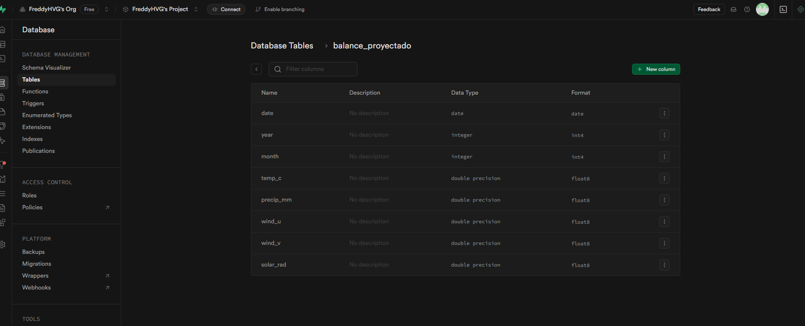

---

## Fase 3: Entrenamiento del Modelo y Proyecciones Futuras

En esta fase trabajamos en el entrenamiento de un modelo de aprendizaje automático (XGBoost) para predecir el balance hídrico mensual. Este modelo se entrenó con datos climáticos históricos de ERA5 (1981–2023) y se utilizó para proyectar escenarios futuros (2024–2050) con datos del conjunto CMIP6. Se implementó un servidor MLflow para rastrear los experimentos y comparar métricas.

---

### 🛠 Preparación del entorno

Instalamos las librerías necesarias y montamos Google Drive para guardar modelos, registros y visualizaciones de forma persistente.

```python
!pip install xgboost mlflow pyngrok --quiet
from google.colab import drive
from pyngrok import conf

drive.mount('/content/drive')
conf.get_default().auth_token = userdata.get("ngrok_token-fv")
```

---

### 🌐 Configurar MLFlow con Ngrok

Se configuró MLflow con URI apuntando a una carpeta en Google Drive para evitar la pérdida de información entre sesiones. Utilizamos Ngrok para exponer la interfaz de seguimiento.

```python
import subprocess, mlflow
os.environ['MLFLOW_TRACKING_URI'] = "/content/drive/MyDrive/.../mlflow_tracking"
mlflow.set_tracking_uri("file:///content/drive/.../mlflow_tracking")
mlflow_process = subprocess.Popen(["mlflow", "ui", "--port", "9090", "--backend-store-uri", os.environ['MLFLOW_TRACKING_URI']])
mlflow_tunnel = ngrok.connect(9090, "http")
```

---

### 📊 Cargar y explorar dataset histórico ERA5

Se cargó el dataset histórico desde Drive. Se realizó exploración inicial para analizar distribución de variables, relaciones entre ellas y detectar patrones anuales o mensuales.

```python
df = pd.read_csv("/content/drive/.../df_balanceH_historico.csv")
df['date'] = pd.to_datetime(df['date'])
df['year'] = df['date'].dt.year
df['month'] = df['date'].dt.month
```

#### 📈 Visualizaciones exploratorias

* Serie de tiempo del balance hídrico mensual
* Dispersión entre radiación solar y PET
* Distribución de temperaturas

También se empleó Bokeh para visualizaciones interactivas:

```python
# Línea de PET mensual
p1 = figure(...)
p1.line('date', 'PET_mm_month', ...)

# Dispersión Precipitación vs PET
p2 = figure(...)
p2.circle(...)
```
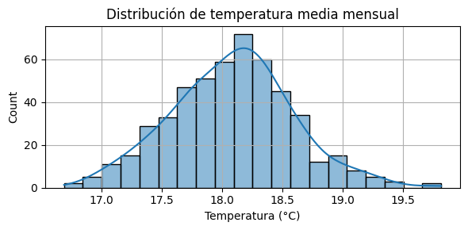
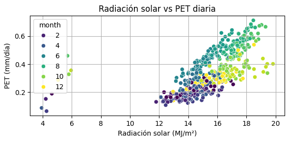
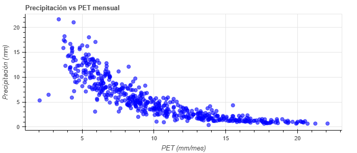

---

### 🤖 Entrenamiento del modelo XGBoost

Se dividió el dataset en entrenamiento (hasta 2020) y prueba (2021–2023). Se normalizaron las variables usando MinMaxScaler y se entrenaron cuatro versiones del modelo variando `n_estimators` y `learning_rate`.

```python
mlflow.set_experiment("balance_hidrico_modelo_xgboost")

param_grid = [...]

for params in param_grid:
    with mlflow.start_run(...):
        model = XGBRegressor(...)
        model.fit(...)
        ...
        mlflow.log_metric("rmse", ...)
```

---

### ✅ Guardar mejor modelo y escaladores

Se seleccionó el mejor modelo mediante métricas en MLflow, se descargó por `run_id` y se guardó como `.pkl` junto con los escaladores para ser reutilizado en la app de Streamlit.

```python
joblib.dump(xgb_model_best, "modelo_xgboost_v1.pkl")
joblib.dump(scaler_X, "scaler_X.pkl")
joblib.dump(scaler_y, "scaler_y.pkl")
```
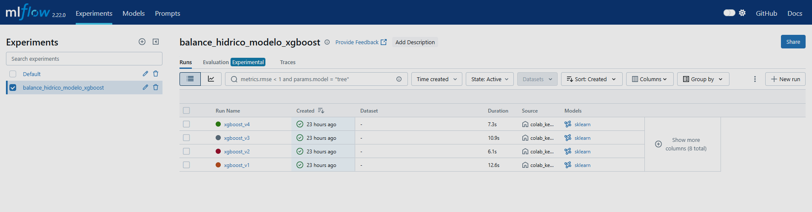

---

### 📉 Evaluación del modelo

Se aplicó el modelo sobre datos de 2021 a 2023 y se comparó la predicción vs los valores reales del balance hídrico con Bokeh.

```python
p = figure(...)
p.line('date', 'balance_mm', ...)
p.line('date', 'y_pred_xgb', ...)
```
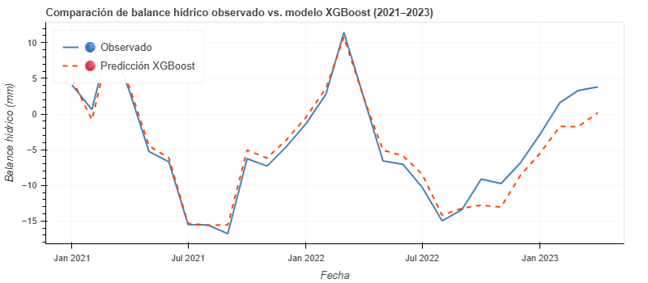

---

### 📈 Proyecciones futuras 2024–2050

Se conectó a Supabase usando su API REST para leer el dataset `balance_proyectado` almacenado previamente (ver Fase 2). Se aplicó el modelo XGBoost y se generó la predicción para cada mes del periodo futuro.

```python
X_new = scaler_X.transform(...)
y_pred = scaler_y.inverse_transform(model.predict(X_new).reshape(-1, 1))
df_input['balance_pred_xgb'] = y_pred
```

#### 🔍 Visualización de proyecciones

* Línea temporal con predicción del balance hídrico 2025–2050.

```python
p = figure(...)
p.line('date', 'balance_pred_xgb', ...)
```
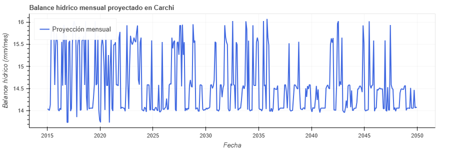

---

Esta fase permitió construir un modelo robusto, trazable y fácilmente reproducible, con métricas monitoreadas y capacidad de realizar proyecciones realistas del balance hídrico a partir de condiciones climáticas futuras.

## Fase 4 - Implementación de la Aplicación Interactiva en Streamlit

La fase final del proyecto consiste en el **despliegue de una aplicación web interactiva utilizando Streamlit**, que permita a usuarios consultar y visualizar el balance hídrico mensual histórico, actual y proyectado. Esta fase organiza la funcionalidad en tres secciones claramente definidas para cubrir distintos tipos de consulta:

---

### 1. Visualización del Balance Hídrico Observado desde GEE (ERA5)

**Objetivo:** Permitir al usuario consultar y visualizar el balance hídrico de cualquier provincia de cualquier país, siempre que esté disponible en la base de GEE. Los datos se obtienen en tiempo real desde ERA5-Land, y se calcula el PET con la ecuación FAO-56.

**Descripción de la lógica:**

* Se toma la selección del usuario de país, provincia, año y mes.
* Se obtiene la información climática correspondiente a ese mes.
* Se calcula la evapotranspiración potencial (PET), la precipitación total y el balance (P - PET).
* Se presentan tres capas en un mapa: PET, precipitación y balance, cada una con su propia barra de colores.

**Visualizaciones:**

* Mapa interactivo generado con geemap, que incluye capas de PET, precipitación y balance.
* Estadísticas resumen (valores mínimos y máximos de cada variable).

---

### 2. Visualización del Balance Hídrico Histórico en Carchi (ERA5)

**Objetivo:** Consultar series temporales del balance hídrico histórico ya procesadas desde ERA5, disponibles en un archivo .csv. Esta opción está limitada a la provincia de **Carchi**, dado que es la única con proyecciones CMIP6 cargadas.

**Descripción de la lógica:**

* Se carga un archivo CSV con los valores mensuales de PET, precipitación y balance desde 1981 hasta 2024.
* El usuario selecciona un rango personalizado de fechas (año y mes de inicio y fin).
* Se filtra el dataset según esa selección.

**Visualizaciones:**

1. **Balance mensual:** Línea con valores mensuales.
2. **Tendencia anual:** Promedios anuales con puntos.
3. **Anomalías:** Diferencias respecto al promedio general del periodo, con barras azules y rojas.

**Herramientas:** Visualización interactiva con Bokeh para permitir mejor exploración.

---

### 3. Visualización de Proyecciones Futuras (CMIP6)

**Objetivo:** Consultar proyecciones futuras del balance hídrico desde el año 2015 hasta 2049, utilizando predicciones generadas con un modelo XGBoost entrenado previamente.

**Descripción de la lógica:**

* Se carga un dataset en formato SQL alojado en **Supabase**, donde se encuentran las proyecciones mensuales de variables climáticas para la provincia de **Carchi**.
* El usuario selecciona un rango de fechas futuras.
* Se transforman las variables climáticas a unidades consistentes con el entrenamiento del modelo (por ejemplo, radiación solar a MJ/m²).
* Se utiliza el modelo `xgb_model_best` cargado como `.pkl` para predecir el balance hídrico.

**Visualizaciones:**

1. **Balance mensual proyectado:** Línea con valores proyectados.
2. **Promedio anual:** Promedios por año.
3. **Anomalías proyectadas:** Comparación respecto al promedio proyectado.

**Herramientas:** Visualizaciones interactivas con Bokeh, tal como en la sección de datos históricos.

---

### Consideraciones Adicionales

* El archivo `app.py` permite la ejecución en Streamlit desde Colab o desde una máquina local.
* Las claves y tokens sensibles (como los de Supabase o Earth Engine) deben almacenarse en `secrets.toml`.
* Las visualizaciones con `geemap` requieren acceso autorizado a GEE.
* Los modelos y escaladores están almacenados en Drive para asegurar persistencia tras reinicios.

**Resultado final:** Una aplicación accesible, flexible y visualmente atractiva, que integra datos observados y proyectados para el monitoreo de condiciones hídricas y la toma de decisiones sobre recursos hídricos en el tiempo.

# 🟩 Fase 5: Despliegue de `app.py` de Streamlit en Colab con ngrok

Esta fase final describe cómo ejecutar el archivo `app.py` en un entorno colaborativo (Colab) utilizando **Streamlit** para el servidor web y **ngrok** como túnel de exposición pública. Esto permite visualizar la aplicación desarrollada en la nube directamente desde un navegador.

---

### 🔧 Requisitos previos

* Haber completado las fases anteriores (datos, modelo y archivo `app.py` funcional).
* Tener credenciales de acceso a **ngrok** configuradas como secreto en Colab (`ngrok_token-fvg`).

---

### ⚙️ Pasos de ejecución

#### 1. 📁 Montar Google Drive en Colab

Esto asegura que `app.py` y todos los recursos del proyecto estén disponibles.

```python
from google.colab import drive
drive.mount('/content/drive')
```

---

#### 2. 🧩 Instalar geemap e inicializar Google Earth Engine

```python
!pip install geemap --upgrade

import geemap
import ee
ee.Authenticate()
ee.Initialize(project="ee-freddyvillota")
```

---

#### 3. 🧪 Instalar librerías para Streamlit y ngrok

```python
!pip install --upgrade streamlit geemap streamlit-folium seaborn pyngrok
```

---

#### 4. 🚪 Configurar y lanzar la aplicación Streamlit

Primero cerrar túneles previos (si existen) y preparar un hilo para ejecutar la app:

```python
from pyngrok import ngrok
ngrok.kill()  # Cerrar cualquier túnel activo

%cd /content/drive/MyDrive/MIAA/Clases/Herramientas IA/Prácticas/balance_hidrico

import threading
import os

def run_app():
    os.system('streamlit run app.py')

thread = threading.Thread(target=run_app)
thread.start()
```

---

#### 5. 🔐 Configurar `pyngrok` con token

```python
from google.colab import userdata
from pyngrok import conf

ngrok_token = userdata.get("ngrok_token-fvg")
conf.get_default().auth_token = ngrok_token
print("✅ ngrok configurado con secreto en Colab.")
```

---

#### 6. 🌐 Exponer el puerto 8501 con ngrok

```python
from pyngrok import ngrok

public_url = ngrok.connect(8501)
print(f"✅ App disponible en: {public_url}")
```

---

# 🧪 RESULTADOS OBTENIDOS EN LA PRUEBA DE LA APLICACIÓN

## Análisis de Balance Hídrico PET calculada y Precipitación para la provincia del Carchi

Durante la validación del sistema, se evaluaron los cálculos del balance hídrico mensual para la provincia de Carchi (Ecuador), específicamente para el mes de julio de 2011. A continuación, se presentan las visualizaciones generadas para tres variables clave: evapotranspiración potencial (PET), precipitación y balance hídrico.

### 🌤️ 1. PET (Evapotranspiración Potencial)

La evapotranspiración potencial (PET) representa la cantidad máxima de agua que se puede evaporar y transpirar desde la superficie si el agua estuviera disponible en cantidad suficiente. En la figura, se observa un patrón espacial con mayores valores de PET en zonas de menor altitud, donde la temperatura y la radiación solar suelen ser más intensas. Las zonas más oscuras (rojo) indican mayor demanda atmosférica de agua.

**Figura 1. PET mensual para Carchi - julio 2011**

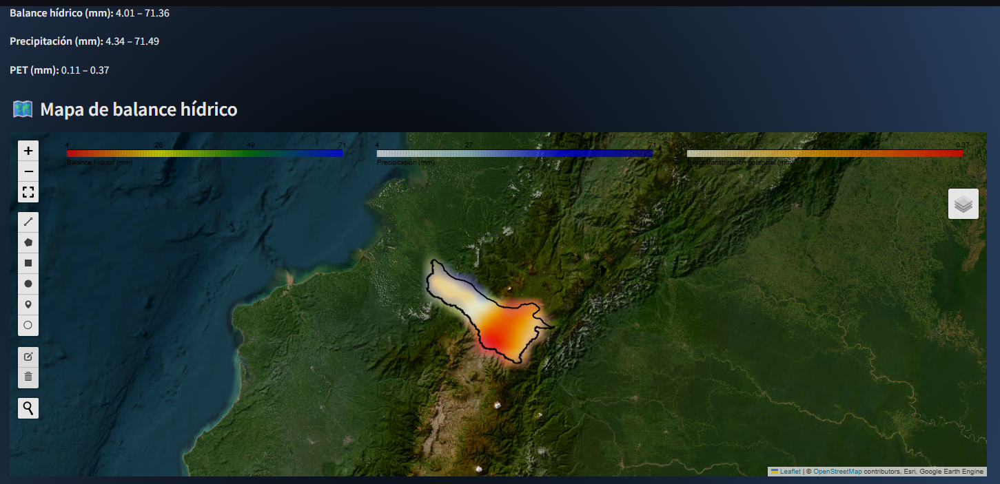


---

### ☔️ 2. Precipitación

La precipitación acumulada mensual muestra una distribución que varía con la topografía, siendo más alta en zonas montañosas del oriente. Las áreas en azul intenso indican regiones con mayor precipitación en el mes analizado. Este valor es esencial para el cálculo del balance hídrico, pues representa el ingreso principal de agua al sistema superficial.

**Figura 2. Precipitación mensual para Carchi - julio 2011**

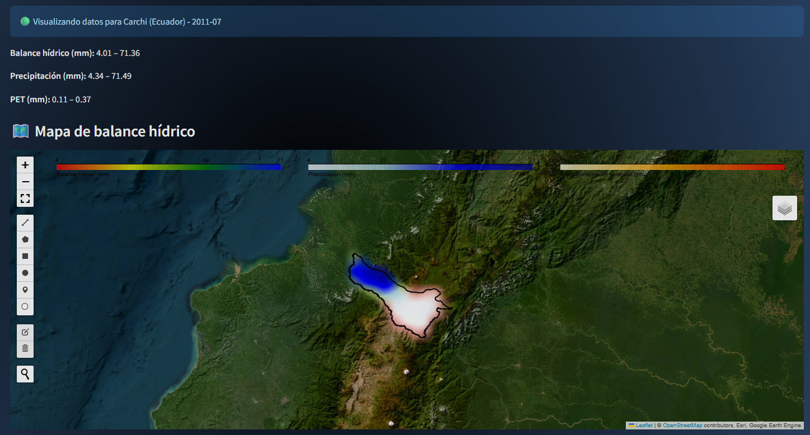

---

### 🌊 3. Balance hídrico mensual

El balance hídrico es el resultado de restar la PET a la precipitación. La figura muestra que en muchas zonas del centro y norte de Carchi existe un superávit hídrico (color azul), es decir, que la precipitación supera a la demanda atmosférica de agua. Por otro lado, las zonas en rojo indican déficit hídrico, donde la evaporación potencial no es completamente satisfecha por la lluvia.

**Figura 3. Balance hídrico mensual para Carchi - julio 2011**

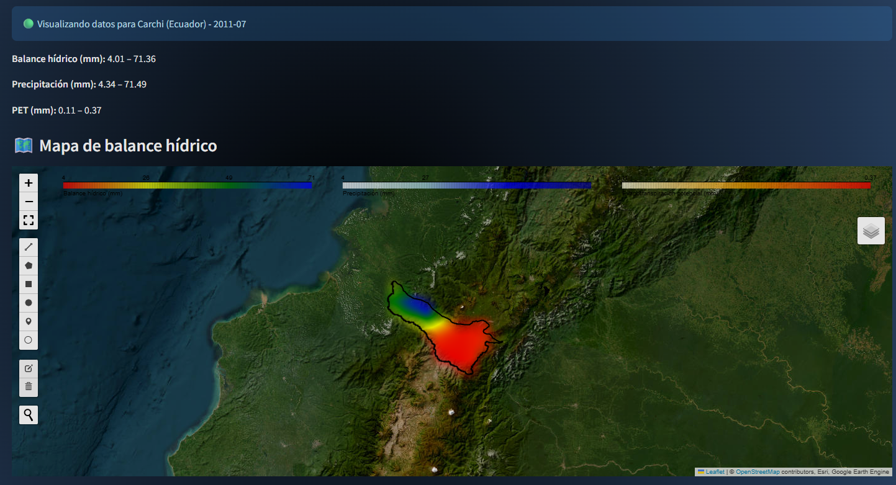

---

## 📊 Análisis histórico del balance hídrico mensual en Carchi (Ecuador)

El análisis histórico del balance hídrico mensual para el período de enero de 1981 hasta diciembre de 2023 proporciona una perspectiva clara de la variabilidad climática en la provincia de Carchi. Esta información es crucial para comprender los patrones de disponibilidad hídrica, identificar años críticos y planificar estrategias de adaptación al cambio climático.

### 🌧️ 1. Balance hídrico mensual

La Figura 1 muestra la serie temporal del balance hídrico mensual. Se observa una marcada estacionalidad, con periodos alternantes de superávit y déficit hídrico. Las oscilaciones reflejan la influencia de eventos climáticos estacionales y fenómenos como El Niño y La Niña, que pueden intensificar las sequías o lluvias en la región.

**Figura 1. Balance hídrico mensual para Carchi (1981–2023)**

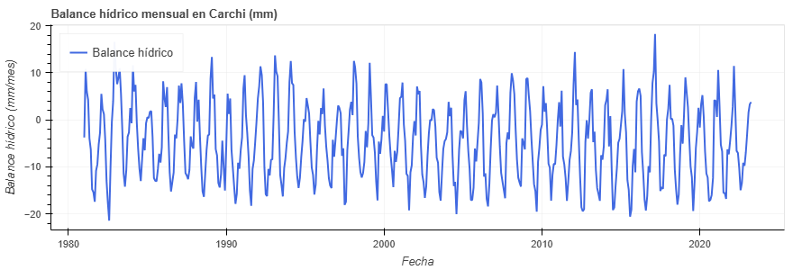

### 📉 2. Tendencia anual del balance hídrico

La Figura 2 representa la tendencia anual del balance hídrico medio en Carchi. A lo largo de las últimas décadas, aunque la variabilidad anual es evidente, se pueden identificar posibles tendencias decrecientes en algunos años, lo cual puede estar asociado a cambios en los patrones de precipitación y evapotranspiración.

**Figura 2. Tendencia anual del balance hídrico promedio en Carchi**

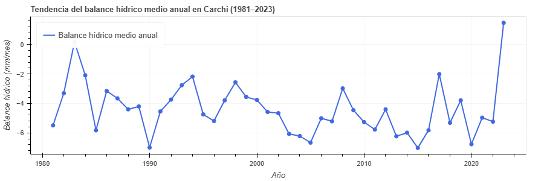

### 🔍 3. Anomalías respecto a la media del periodo

La Figura 3 muestra las anomalías anuales del balance hídrico respecto a la media del periodo completo. Las barras azules indican años con balance hídrico por encima del promedio, mientras que las barras rojas representan años con déficit. Esta visualización permite detectar eventos extremos que podrían tener impactos significativos en los sistemas agrícolas y en la disponibilidad de agua.

**Figura 3. Anomalías del balance hídrico anual respecto al promedio**

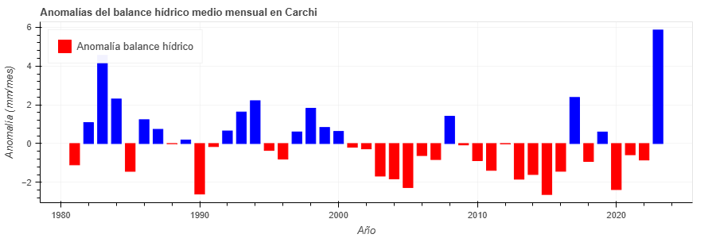
---

## 🔮 Proyección del balance hídrico mensual en Carchi (Ecuador)

El análisis de proyección del balance hídrico mensual en Carchi para el período de mayo de 2015 hasta junio de 2049 se fundamenta en el uso de datos climáticos proyectados (CMIP6) y la aplicación de un modelo de aprendizaje automático (XGBoost). Esta sección ofrece una estimación del comportamiento futuro del recurso hídrico en la región bajo condiciones de cambio climático.

### 📆 1. Proyección mensual del balance hídrico

La Figura 1 muestra la evolución proyectada del balance hídrico mensual. Se aprecian ciclos de variación regular, con algunos periodos en los que se anticipan déficits hídricos más pronunciados, especialmente hacia las décadas de 2030 y 2040.

**Figura 1. Proyección del balance hídrico mensual (2015–2049)**

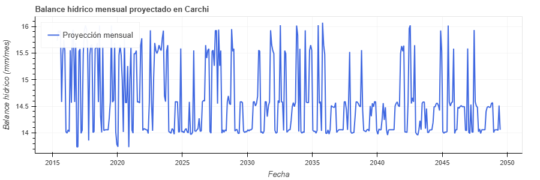

### 📉 2. Tendencia anual del balance hídrico proyectado

La Figura 2 presenta el promedio anual proyectado del balance hídrico. Aunque se observa variabilidad interanual, existe una ligera tendencia a la disminución en los valores promedios anuales, lo que sugiere un potencial aumento en el estrés hídrico regional a futuro.

**Figura 2. Tendencia anual del balance hídrico proyectado**

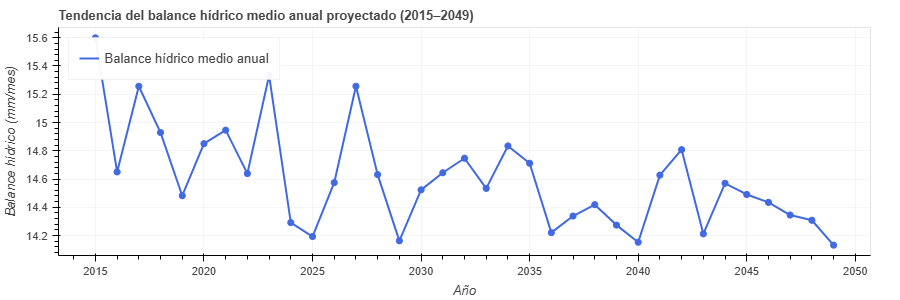

### 🔍 3. Anomalías futuras del balance hídrico

La Figura 3 muestra las anomalías anuales del balance hídrico futuro respecto al promedio proyectado. Los valores negativos indican años más secos que la media, mientras que los positivos reflejan años con mayor disponibilidad hídrica. Esta herramienta es útil para anticipar posibles impactos en la agricultura, la gestión de cuencas y la planificación del uso del agua.

**Figura 3. Anomalías del balance hídrico proyectado (2015–2049)**

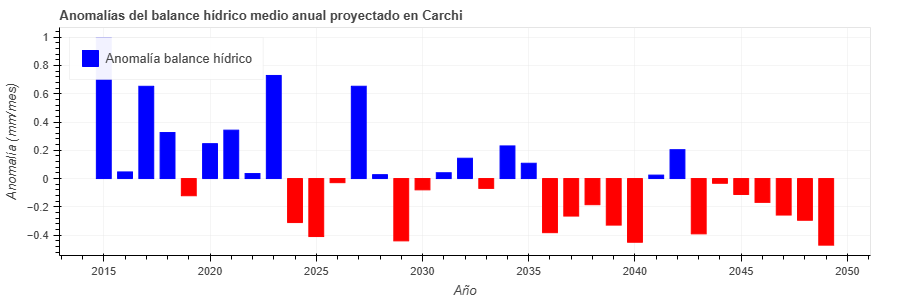


# CONCLUSIONES

El presente proyecto permitió desarrollar un sistema interactivo para el análisis del balance hídrico mensual en la provincia de Carchi, Ecuador, integrando datos climáticos históricos y proyecciones futuras mediante herramientas de código abierto y plataformas de acceso gratuito. La aplicación diseñada con Streamlit demostró ser efectiva al ofrecer una visualización intuitiva y dinámica que facilita la comprensión de patrones climáticos complejos, tanto para usuarios técnicos como no técnicos.

El uso de datos de ERA5-Land permitió estimaciones confiables del balance hídrico histórico, con el cálculo de la evapotranspiración potencial (PET) mediante la metodología de Penman-Monteith (FAO-56), implementada sobre imágenes mensuales. Por otro lado, las proyecciones futuras generadas a partir del conjunto de datos CMIP6 y modeladas con XGBoost, permitieron explorar escenarios de cambio climático y su potencial impacto sobre la disponibilidad hídrica en la región.

Asimismo, la integración de tecnologías como Google Earth Engine, geemap, Supabase y MLflow favoreció la reproducibilidad, escalabilidad y trazabilidad del flujo de trabajo, garantizando buenas prácticas en la gestión de datos, el entrenamiento de modelos y la presentación de resultados.

En términos generales, este proyecto evidencia el potencial del uso combinado de inteligencia artificial y datos satelitales abiertos en el monitoreo climático, así como su aplicabilidad para la toma de decisiones en planificación territorial, gestión del agua y adaptación al cambio climático. Finalmente, se sienta un precedente técnico y metodológico que puede ser replicado en otras provincias o países con características climáticas similares.

# REFERENCIAS

Bisong, E. (2019). Google Colaboratory. En Building Machine Learning and Deep Learning Models on Google Cloud Platform (pp. 59–64). Apress. https://doi.org/10.1007/978-1-4842-4470-8_7

Bokeh. (s.f.). Bokeh documentation. Recuperado de https://docs.bokeh.org/en/latest/

Doods and Whiles (2010). *Freshwater Ecology: Concepts and Environmental Applications of Limnology*. Academic Press. 2nd Edition. 

Eyring, V., Bony, S., Meehl, G. A., Senior, C. A., Stevens, B., Stouffer, R. J., & Taylor, K. E. (2016). Overview of the Coupled Model Intercomparison Project Phase 6 (CMIP6) experimental design and organization. Geoscientific Model Development, 9(5), 1937–1958. https://doi.org/10.5194/gmd-9-1937-2016

Geemap. (s.f.). Geemap documentation. Recuperado de https://geemap.org/

Google Developers. (s.f.). Earth Engine. Recuperado de https://developers.google.com/earth-engine

Hersbach, H., Bell, B., Berrisford, P., Biavati, G., Horányi, A., Muñoz Sabater, J., Nicolas, J., Peubey, C., Radu, R., Rozum, I., Schepers, D., Simmons, A., Soci, C., Dee, D., Thépaut, J-N. (2023). ERA5 hourly data on single levels from 1940 to present. Copernicus Climate Change Service (C3S) Climate Data Store (CDS), DOI: 10.24381/cds.adbb2d47

Holmgren, W. F., Andrews, R. W., Lorenzo, A. T., & Stein, J. S. (2015, June). PVLIB python 2015. In 2015 ieee 42nd photovoltaic specialist conference (pvsc) (pp. 1-5). IEEE.

Muñoz Sabater, J. (2019). ERA5-Land hourly data from 1981 to present. Copernicus Climate Change Service (C3S) Climate Data Store (CDS). https://doi.org/10.24381/cds.e2161bac

Pedregosa, F., Varoquaux, G., Gramfort, A., Michel, V., Thirion, B., Grisel, O., ... & Duchesnay, E. (2011). Scikit-learn: Machine learning in Python. Journal of Machine Learning Research, 12, 2825–2830. https://jmlr.csail.mit.edu/papers/v12/pedregosa11a.html

Program for Climate Model Diagnosis and Intercomparison. (2019, February 13). CMIP6 - Coupled Model Intercomparison Project Phase 6 overview. Lawrence Livermore National Laboratory. https://esgf-node.llnl.gov/projects/cmip6/

Pyngrok. (s.f.). pyngrok documentation. Recuperado de https://pyngrok.readthedocs.io/en/latest/

Streamlit. (s.f.). Streamlit documentation. Recuperado de https://docs.streamlit.io/

Supabase. (2024). Official Supabase documentation. https://supabase.com/docs

Wu, Q. (2021, diciembre 15). Creating satellite timelapse with Streamlit and Earth Engine. Streamlit Blog. Recuperado de https://blog.streamlit.io/creating-satellite-timelapse-with-streamlit-and-earth-engine/

Zaharia, M., Chen, A., Davidson, A., Ghodsi, A., Hong, S. A., Konwinski, A., ... & Zumar, C. (2018). Accelerating the machine learning lifecycle with MLflow. IEEE Data Eng. Bull., 41(4), 39-45.
